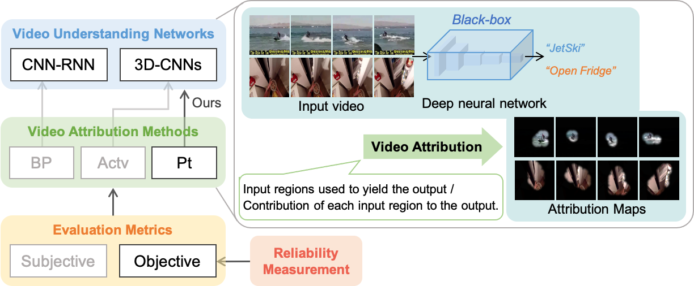
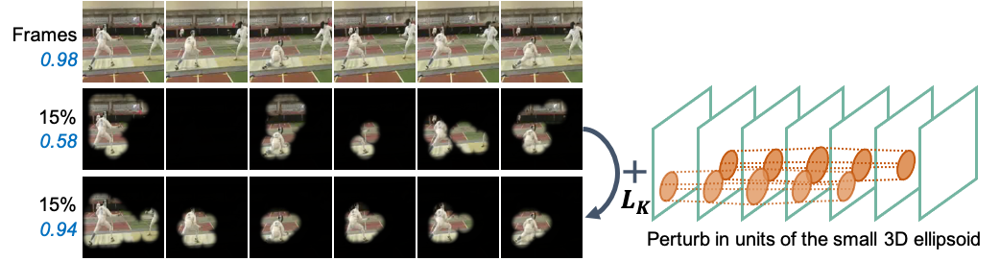

# Spatio-Temporal Perturbations for Video Attribution

Code for paper on TCSVT 2021: [Spatio-Temporal Perturbations for Video Attribution](https://arxiv.org/abs/2109.00222#:~:text=The%20attribution%20method%20provides%20a,the%20output%20of%20a%20network.), which is an extension paper of our previous work on WACV 2021: [Towards Visually Explaining Video Understanding Networks with Perturbation](https://arxiv.org/abs/2005.00375).

<!--  -->


The project is build upon Github repo of [Video-Visual-Explanations](https://github.com/shinkyo0513/Video-Visual-Explanations).

More details regarding the code will be elaborated soon.

<!--  -->


## Reference

### TCSVT 2021
```
@article{VideoAttribution,
  title={Spatio-Temporal Perturbations for Video Attribution}, 
  author={Li, Zhenqiang and Wang, Weimin and Li, Zuoyue and Huang, Yifei and Sato, Yoichi},
  journal={IEEE Transactions on Circuits and Systems for Video Technology}, 
  year={2021},
  doi={10.1109/TCSVT.2021.3081761}}
```

### WACV 2021
```
@article{li2020comprehensive,
  title={A Comprehensive Study on Visual Explanations for Spatio-temporal Networks},
  author={Li, Zhenqiang and Wang, Weimin and Li, Zuoyue and Huang, Yifei and Sato, Yoichi},
  journal={arXiv preprint arXiv:2005.00375},
  year={2020}
}
```
